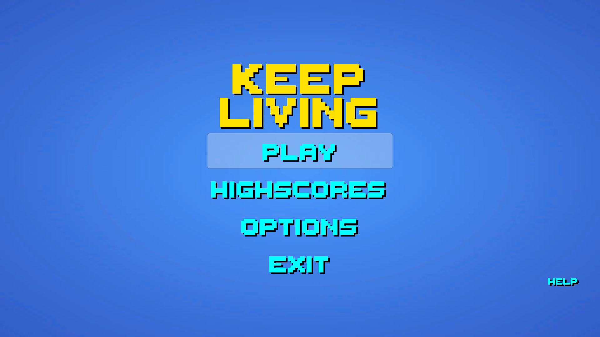
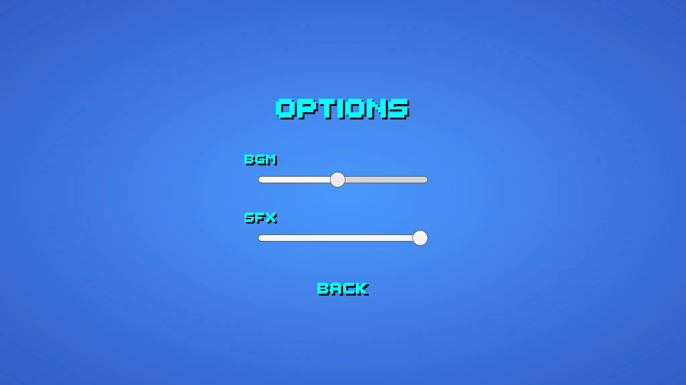
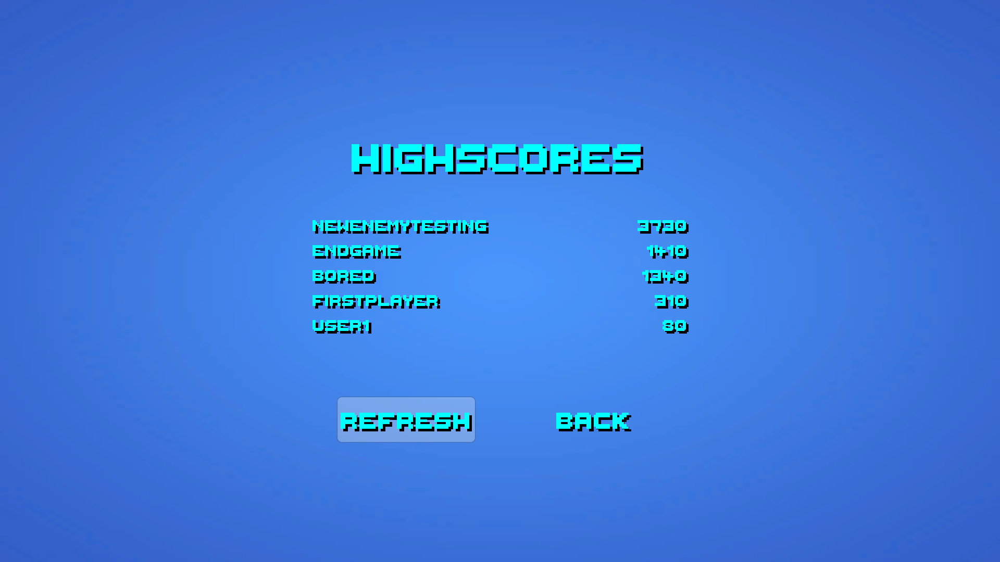
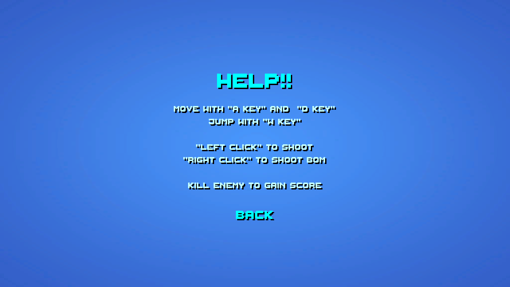
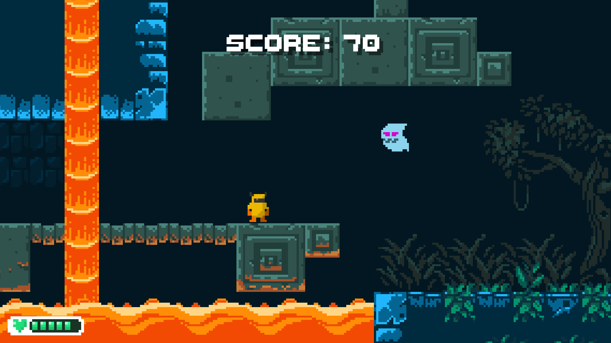
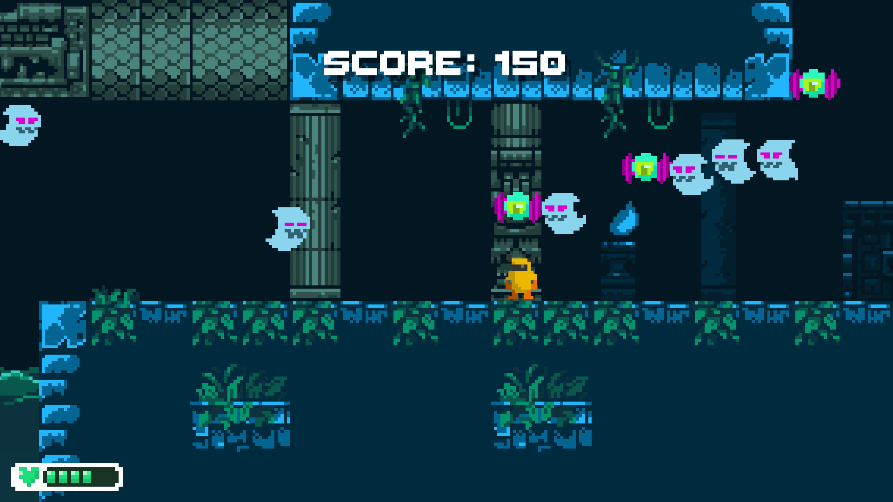
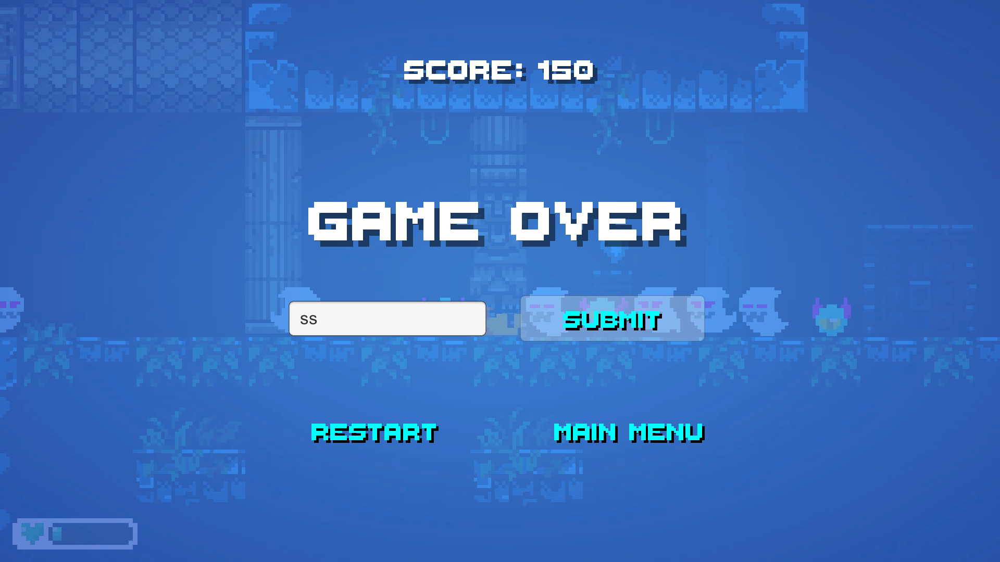

# keep-living-survival-shooter

The WebGL game can be accessed on https://a-johanes.github.io/keep-living-survival-shooter/

# IF3210-2020-Unity-13517012

## Deskripsi Aplikasi

Merupakan _game platformer 2D_ bernama "Keep Living" dengan _gameplay survival shooting_. Akan terdapat sebuah karakter yang dapat berjalan, melompat dan menembak. Akan ada musuh yang akang mendekat dan menyerang.

_Game_ dibuat dengan menggunakan Unity versi `2019.3.2f1` untuk dijalankan pada platform _Desktop_.

## Cara Kerja

Pertama kali akan ditampilkan _scene_ `MainMenu` yang berisi tombol Play, Highscores, options, exit dan help.

- Play, akan memulai permainan
- Highscores akan menampilkan _top highscore_ dalam _game_ yang diambil dengan menggunakan `GET` _request_
- Options akan menampilkan _settings_ yang dapat diubah oelh pemain berupa _volume_ BGM dan SFX. Setting ini disimpan pada PlayerPref sehingga akan selalu konsisten meskipun permainan dimatikan.
- Exit akan keluar dari permainan
- Help menampilkan _control_ yang digunakan dalam permainan

Control yang digunakan adalah:

- `A` dan `D` untuk bergerak ke kiri dan kanan
- `W` untuk melompat
- `Left Click` untuk menembak biasa
- `Right Click` untuk menembakkan peluru bom (senjata kedua)

Player akan memulai permainan dengan nyawa 100. Seiring permainan, nyawa akan berkurang karena diserang oleh musuh saat bersentuhan. Pada saat nyawa sudah 0, maka permainan akan berakhir. Setiap pergerakan pemain ada animasinya, saat berjalan, melompat, menembak dan mati yang gerakannya sesuai dengan hukum fisika. Pada saat menembak, melompat, dan _landing_ akan terdapat SFX yang dimainkan. Begitu pula saat serangan mengenai musuh atau bom meledak.

Kamera dibuat dengan efek _floating_ yang akan mengikuti perpindahan pemain. Kamera akan mengusahakan posisi karakter akan selalu ditengah dengan sedikit _offset_ yang memperlihatkan arah pemain sehingga mendapat visual yang lebih banyak.

Terdapat 2 jenis _enemy_ dalam permaninan ini. Kedua _enemy_ merupakan musuh terbang yaitu "ghost" dan "eye". "Ghost" memiliki nyawa dan serangan yang lebih kecil dari pada "eye" namun bergerak lebih cepat. Kedua _enemy_ ini akan di-_spawn_ pada posisi acak yang telah ditentukan sebelumnya pada selang waktu tertentu. Dengan seiring berjalannya waktu, musuh akan menjadi lebih susah dikalahkan dengan bertambahnya nyawa dan kecepatan. Dengan semakin sulitnya musuh, maka _score_ yang didapatkan juga bertambah.

Setiap _enemy_ akan memiliki _score_ masing-masing dan pada saat mati akan menambahkan nilai _score_ total pemain yang ditampikan di layar bagian atas. Di akhir permainan, pemain dapat meng-_upload score_-nya sehingga disimpan di _server online_ dengan menggunakan `POST` _request_ sehingga dapat ditampilkan di halaman Highscores.

Terakhir, karena `Instantiate` dan `Destroy` merupakan operasi yang mahal, maka digunakan metode _spawn_ objek dengan konsep _object pooling_ dengan `Instantiate` semua objek di awal dan akan di-_reuse_.

## Package External

Beberapa _package external_ yang digunakan:

- A* Pathfinding Project: digunakan untuk membantu *enemy\* menavigasi lingkungan permaianan untuk mengejar pemain
- 2D Tilemap Extension: merupakan fitur beta di Untiy, digunakan untuk membuat tileset yang dapat dianimasikan sehingga mempermudah game desain

## Screenshot

